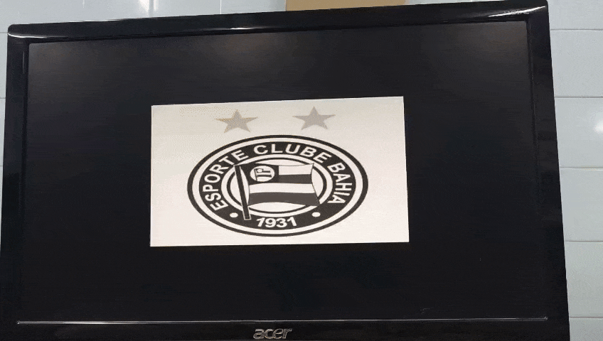
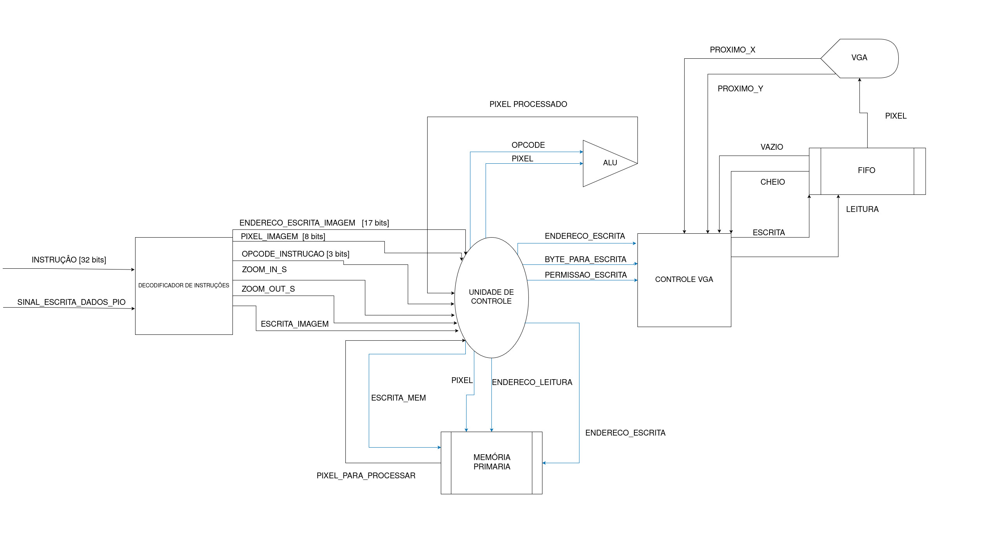

# 📘 Zoom Digital – 2º Etapa

## Integração HPS–FPGA e API ARMv7 para Controle do Coprocessador de Redimensionamento de Imagens

<div align="center">
  
</div>

Esta fase do projeto estende a Etapa 1, onde foi criado um **coprocessador em Verilog** capaz de executar algoritmos de redimensionamento de imagens (Zoom In / Zoom Out).
Na Etapa 2, o foco é a **integração entre o HPS (ARM Cortex-A9)** e o coprocessador na FPGA, por meio de uma **API escrita em Assembly ARMv7**, que permite:

✔ Enviar imagens `.pgm` para a FPGA
✔ Enviar instruções (opcodes) para o coprocessador
✔ Controlar o pipeline de processamento via Linux no HPS

---

# 📌 1. Levantamento de Requisitos da Etapa 2

Os requisitos estabelecidos pelo enunciado incluíram:

### **Requisitos Funcionais**

* Implementar **API em Assembly ARMv7** executando no HPS.
* Permitir que a API leia imagens de arquivo no Linux.
* Permitir o envio da imagem (320×240, grayscale, 8 bits/pixel) para a FPGA.
* Enviar instruções para o coprocessador via **memory-mapped I/O**.
* ***Não há mais uso de registrador ENABLE** na versão final: o envio da instrução é suficiente para disparar o hardware.*
* Controlar os quatro algoritmos implementados na Etapa 1:

  * Replicação de Pixel
  * Vizinho Mais Próximo
  * Decimação
  * Média de Blocos

### **Requisitos Não-Funcionais**

* Compatibilidade com Linux embarcado da DE1-SoC.
* Organização modular do Assembly.
* Uso adequado de syscalls (`open`, `read`, `mmap2`, `close`, `munmap`).
* Robustez no mapeamento e fechamento de endereços.

---

# 🧰 2. Softwares Utilizados

## 🟦 Ferramentas de Desenvolvimento

| Software                       | Versão                   | Uso                           |
| ------------------------------ | ------------------------ | ----------------------------- |
| **Ubuntu Linux (HPS DE1-SoC)** | 4.x                      | Execução da API ARMv7         |
| **Assembler ARMv7 – GNU AS**   | arm-none-linux-gnueabihf | Montar `biblioteca.s`         |
| **GCC ARM Embedded**           | arm-linux-gnueabihf-gcc  | Compilar `main.c`             |
| **Quartus Prime**              | 23.1                     | Compilar FPGA (coprocessador) |
| **Make**                       | Linux padrão             | Automação de build            |

---

# 🧱 3. Hardwares Utilizados

| Hardware                            | Função no sistema                          |
| ----------------------------------- | ------------------------------------------ |
| **DE1-SoC (Terasic)**               | Plataforma HPS + FPGA                      |
| **ARM Cortex-A9 Dual Core**         | Execução da API ARMv7                      |
| **FPGA Cyclone V SE 5CSEMA5F31C6N** | Execução do coprocessador gráfico          |
| **VGA DAC ADV7123**                 | Exibição da imagem processada              |
| **Memória M10K**                    | Armazenamento temporário da imagem na FPGA |
| **microSD com Linux**               | Boot do sistema do HPS                     |

---

# ⚙️ 4. Estrutura Geral da Etapa 2

A solução final é composta por:

### **1. Coprocessador em Verilog (Etapa 1)**

* Recebe pixels via memória mapeada.
* Processa usando um dos quatro algoritmos.
* Renderiza resultado via VGA.

### **2. API ARMv7 (`biblioteca.s`)**

* Mapeia registradores da FPGA via `/dev/mem`.
* Lê e interpreta um arquivo `.pgm`.
* Copia 76.800 bytes para a FPGA.
* Escreve o opcode no registrador de instruções.

### **3. Aplicação em C (`main.c`)**

* Interface entre o usuário e a API Assembly.
* Permite escolher o algoritmo via terminal.

---

# 🧩 5. Arquitetura do Sistema

```
            +---------------------------+
            |        Aplicação C        |
            +-------------+-------------+
                          |
                     chama API
                          |
            +-------------v-------------+
            |     API ARMv7 Assembly    |
            |  - mmap() de registradores|
            |  - leitura .pgm           |
            |  - envio de pixels        |
            |  - envio de opcode        |
            +-------------+-------------+
                          |
                 Memory-Mapped I/O
                          |
            +-------------v-------------+
            |    Coprocessador FPGA     |
            |  - FSM de controle        |
            |  - ULA de zoom            |
            |  - Memória M10K           |
            +-------------+-------------+
                          |
                          |
                     Imagem VGA
```

# 6. Conexão entre os módulos do sistema


---

# 📜 7. API ARMv7 – Descrição Detalhada

O arquivo:

```
api/biblioteca.s
```

contém as seguintes funções globais:

| Função               | Descrição                                                                                                                                                                                          | Parâmetros (Entrada)                                                                                                                        | Retorno (Saída)                                |
|----------------------|----------------------------------------------------------------------------------------------------------------------------------------------------------------------------------------------------|---------------------------------------------------------------------------------------------------------------------------------------------|------------------------------------------------|
| mapear_enderecos     | Abre o dispositivo `/dev/mem` e mapeia a região 0xFF200000 da FPGA (lightweight HPS-to-FPGA bridge) usando `open` e `mmap2`. O ponteiro de instruções e o File Descriptor (FD) são armazenados em variáveis globais. | Nenhum                                                                                                                                       | Nenhum (As variáveis globais são atualizadas)  |
| enviar_imagem_fpga   | Carrega uma imagem PGM do disco (via chamada interna a `abrir_imagem`) e transmite os 76800 bytes de pixel para o registrador da FPGA. Cada pixel é formatado como uma instrução de 32 bits (Opcode 0b111 nos bits [31:29]). | `r0 = Ponteiro para o input buffer` .                                        | Nenhum                                         |
| replicacao_pixel     | Envia o comando de Zoom In utilizando o algoritmo de replicação de pixel. Escreve o opcode de comando (`0x80000000`) no registrador de instruções da FPGA.                                         | Nenhum                                                                                                                                       | Nenhum                                         |
| vizinho_mais_proximo | Envia o comando de Zoom In utilizando o algoritmo de interpolação por vizinho mais próximo. Escreve o opcode de comando (`0x60000000`).                                                             | Nenhum                                                                                                                                       | Nenhum                                         |
| decimacao            | Envia o comando de Zoom Out utilizando o algoritmo de decimação. Escreve o opcode de comando (`0xA0000000`).                                                                                       | Nenhum                                                                                                                                       | Nenhum                                         |
| media_de_blocos      | Envia o comando de Zoom Out utilizando o algoritmo de média de blocos. Escreve o opcode de comando (`0xC0000000`).                                                                                 | Nenhum                                                                                                                                       | Nenhum                                         |
| fechar_enderecos     | Libera os recursos do sistema: realiza `munmap` na região de memória mapeada e fecha todos os File Descriptors abertos (`/dev/mem` e o arquivo de imagem) usando `close`.                           | Nenhum                                                                                                                                       | Nenhum                                         |


### ❗ Importante: **a versão final NÃO usa mais registrador ENABLE**

* O envio do opcode por si só já inicia a operação.
* O hardware lê o opcode automaticamente ao detectar escrita no registrador.

---

# 🖼️ 8. Formato da Imagem `.pgm`

A API espera:

* Formato: **Grayscale**
* Resolução fixa: **320 × 240**
* Tamanho: **76.800 bytes** após o cabeçalho
* 1 byte por pixel (0–255)

---

# 🔍 9. Mapeamento de Endereços FPGA

A API usa:

```
/dev/mem
```

para mapear o endereço base:

```
0xFF200000
```

com offset para:

* Registrador de instruções
* Registrador de memória de imagem

O tamanho mapeado é:

```
0x00005000 bytes
```

---

# 📡 10. Protocolo de Comunicação HPS → FPGA

A comunicação consiste em:

### 1. Escrever os bytes da imagem

No registrador de memória mapeado.

### 2. Escrever o opcode

Nos valores:

| Algoritmo       | Opcode       |
| --------------- | ------------ |
| Replicação      | `0x80000000` |
| Vizinho Próximo | `0x60000000` |
| Decimação       | `0xA0000000` |
| Média           | `0xC0000000` |

### 3. A FSM da FPGA lê automaticamente

A simples escrita no registrador inicia o processamento — não há pulso de enable na versão final.

---

# 🧪 11. Testes Realizados

### ✔ Teste 1: Mapeamento `/dev/mem`

* Sucesso no acesso ao lightweight HPS-to-FPGA bridge.

### ✔ Teste 2: Leitura de imagem `.pgm`

* Cabeçalho descartado corretamente.
* Pixels armazenados no buffer.

### ✔ Teste 3: Envio de pixels

* A imagem bruta apareceu corretamente na VGA.

### ✔ Teste 4: Execução de cada algoritmo

* Comparação visual com simulações da Etapa 1.
* Todos os quatro algoritmos funcionaram corretamente.

### ✔ Teste 5: Execução sequencial

* Enviar múltiplas instruções em sequência funciona sem necessidade de reset.

---

# 📊 12. Resultados Alcançados

* Comunicação HPS ↔ FPGA 100% funcional.
* A versão final sem ENABLE ficou mais simples e robusta.
* A API ARMv7 funciona como um driver user space.
* O coprocessador opera corretamente com opcodes enviados via software.
* A imagem processada aparece em tempo real via VGA.
* O sistema se tornou um pipeline híbrido completo:
  **Software (ARM) → Hardware (FPGA) → Exibição (VGA)**.

---

# 🚀 13. Conclusão da Etapa 2

A Etapa 2 adicionou à solução:

* Controle em alto nível pelo HPS
* Automação via software
* Leitura externa de imagens
* Mapeamento de hardware com ARMv7
* Comunicação robusta sem sinais extras como “enable”
* Integração total com o coprocessador construído na Etapa 1

---

# 📚 14. Referências

PATTERSON, D. A.; HENNESSY, J. L. Computer organization and design : the hardware/software interface, ARM edition / Computer organization and design : the hardware/software interface, ARM edition.

‌Cyclone V Device Overview. Disponível em: https://www.intel.com/content/www/us/en/docs/programmable/683694/current/cyclone-v-device-overview.html.

FPGAcademy. Disponível em: https://fpgacademy.org.

TECHNOLOGIES, T. Terasic - SoC Platform - Cyclone - DE1-SoC Board. Disponível em: https://www.terasic.com.tw/cgi-bin/page/archive.pl?Language=English&No=836.

NIRILU. ARM32 Syscall Reference. Disponível em: https://nirilu.github.io/arm32-syscall-ref.github.io/.

---

## 👨‍💻 Autores

**Ítallo Guimarães**
📍 Universidade Estadual de Feira de Santana (UEFS)
📧 contato: italloguimaraes1@gmail.com

**Lucas Silva**
📍 Universidade Estadual de Feira de Santana (UEFS)
📧 contato: lucasoliveiraecomp@gmail.com

**Kevin Borges**
📍 Universidade Estadual de Feira de Santana (UEFS)
📧 contato: kcordeiro539@gmail.com

---
